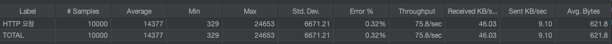
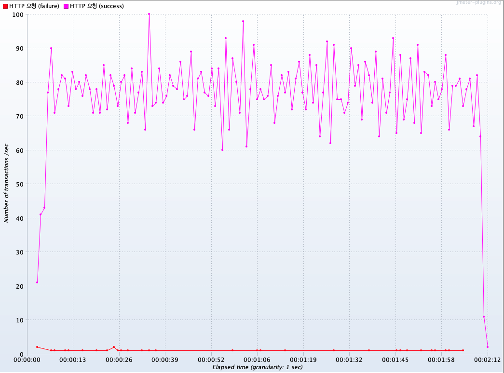
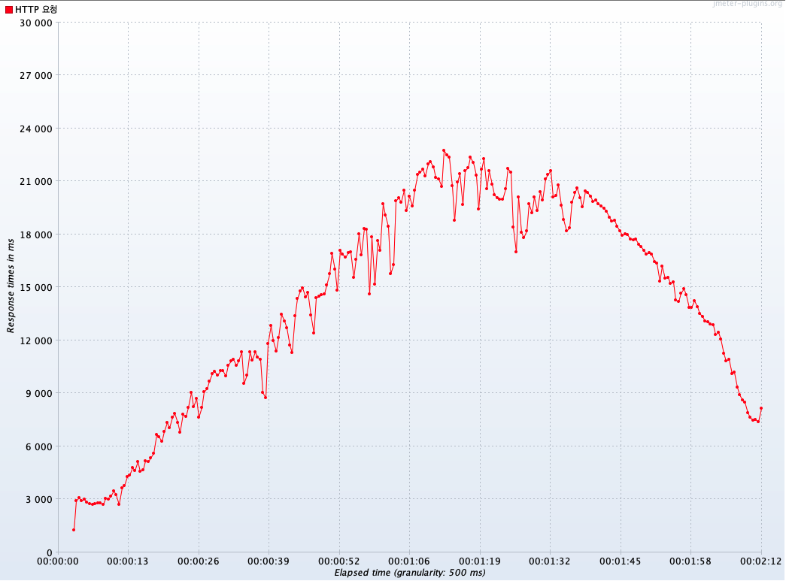
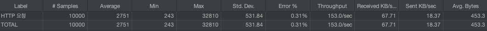
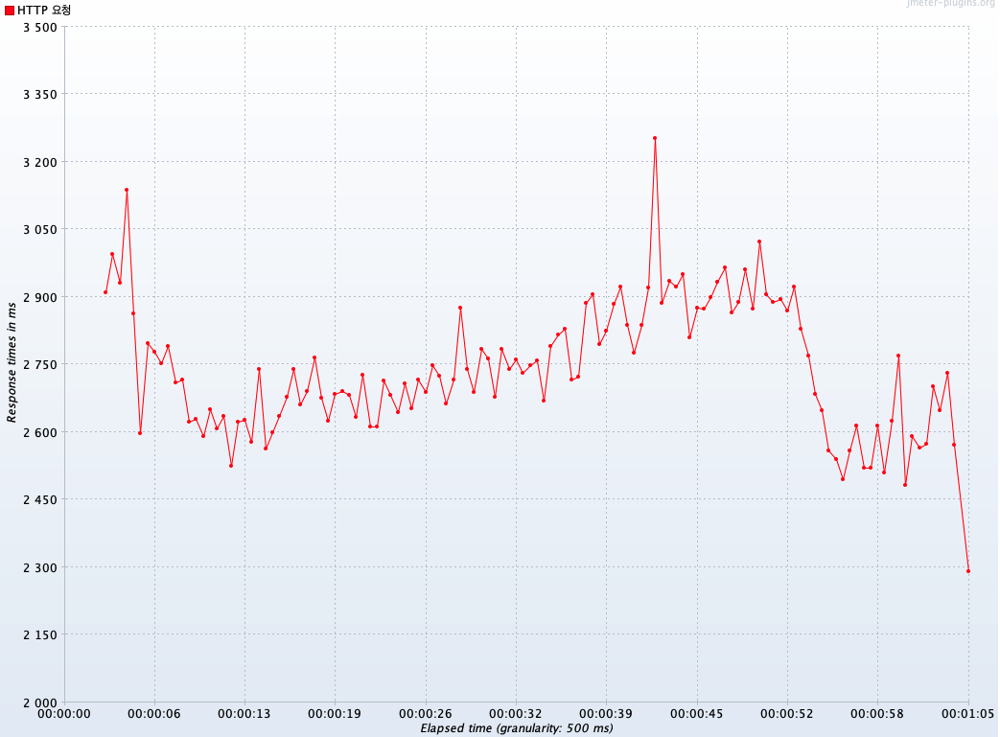

# Spring MVC, Webflux 성능 비교

- jmeter를 사용하여 테스트를 진행하였습니다.

## 1. http 통신 지연 테스트
> https://httpbin.org/delay/2 해당 url에 http 통신을 하여 (지연시간 2초) response 받은 결과를 리턴하는 API

- jmeter 설정
  - Number of Threads: 2000
  - Ramp-up period: 50s
  - Loop Count: 5

결과: WebFlux가 MVC보다 **약 2배 많은 처리량**을 보여주었고 **응답시간 또한 5.2배 빨랐**습니다.

### MVC
- 처리량: 75.8 / sec
- 응답 평균: 14,377ms

> 요약 보고서

> tps grape

> 응답 시간 grape

### WebFlux
- 처리량: 153 / sec
- 응답 평균: 2,751ms

> 요약 보고서

> tps grape

> 응답 시간 grape

