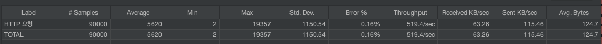
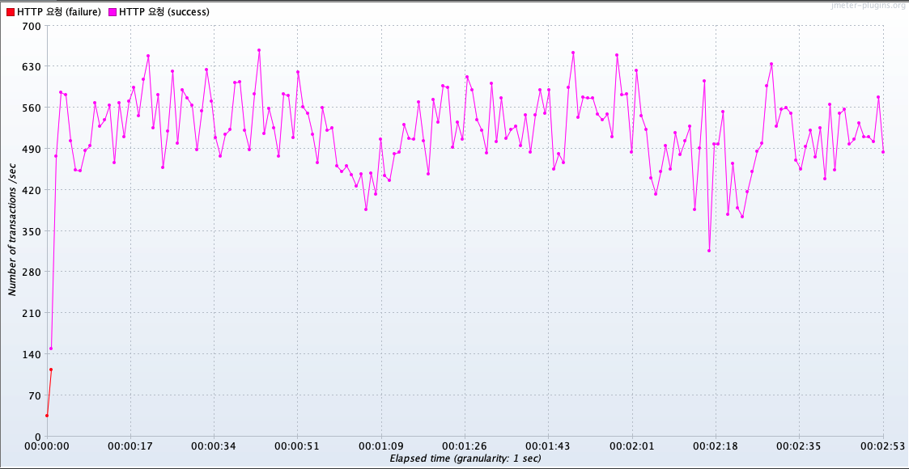
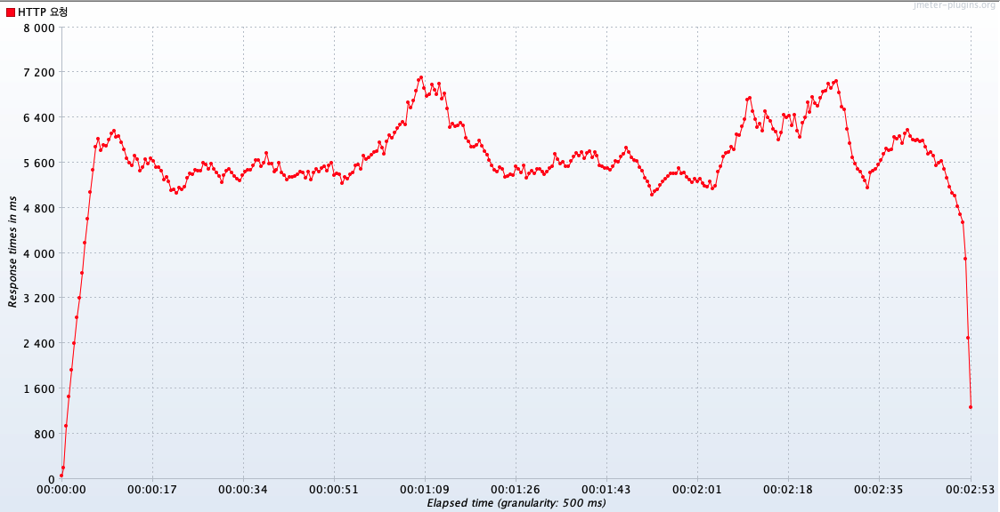
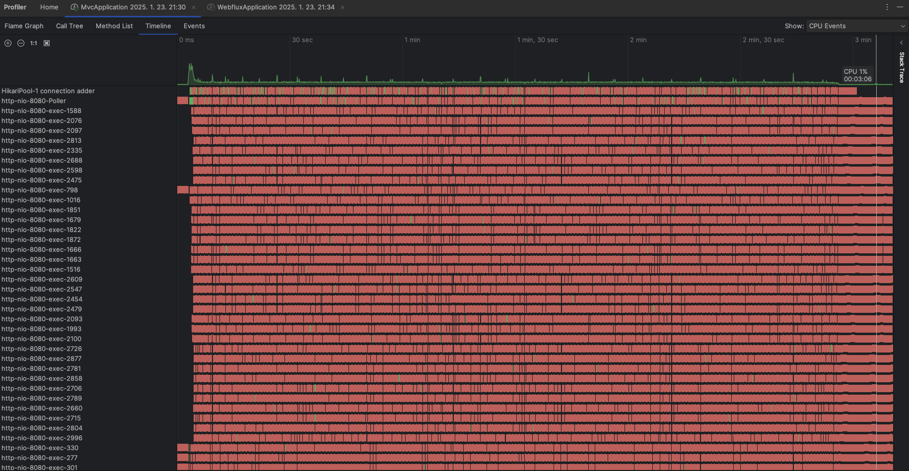
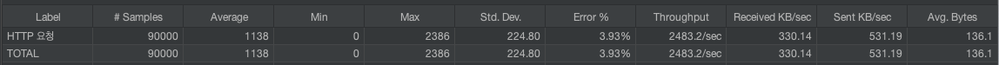
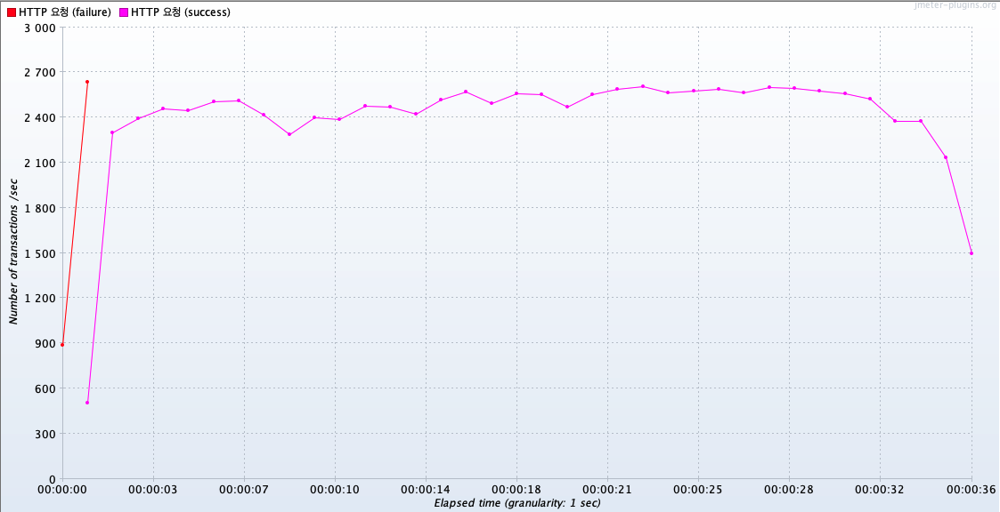
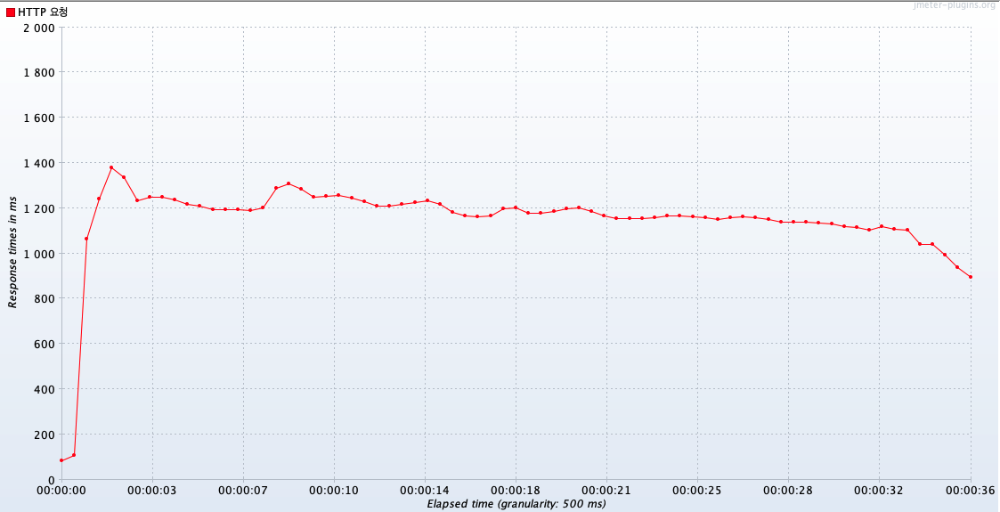
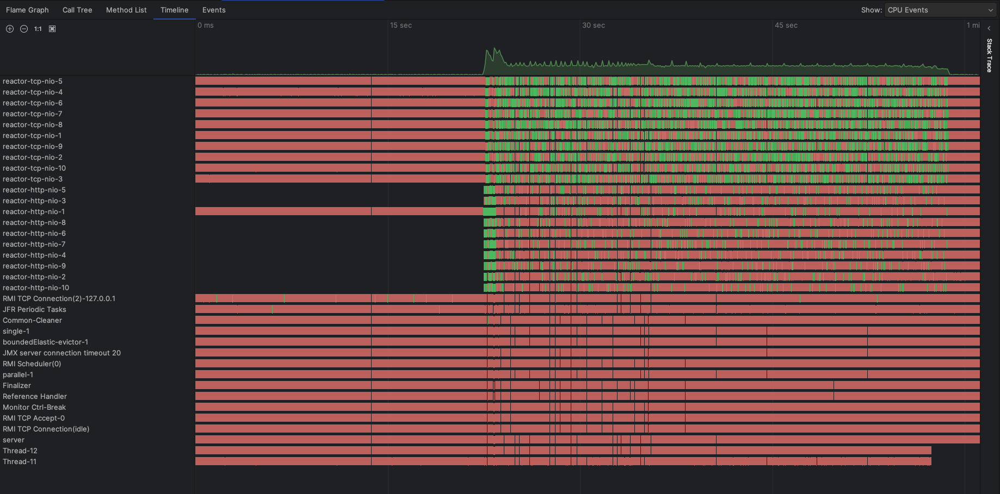

# Spring MVC, Webflux 성능 비교

- jmeter를 사용하여 테스트를 진행하였습니다.

---

## 1. http 통신 지연 테스트
> https://httpbin.org/delay/2 해당 url에 http 통신을 하여 (지연시간 2초) response 받은 결과를 리턴하는 API

- jmeter 설정
  - Number of Threads: 2000
  - Ramp-up period: 50s
  - Loop Count: 5

결과: WebFlux가 MVC보다 **약 2배 많은 처리량**을 보여주었고 **응답시간 또한 5.2배 빨랐**습니다.

### MVC
- 처리량: 75.8/sec
- 응답 평균: 14,377ms

> 요약 보고서


> tps grape


> 응답 시간 grape


### WebFlux
- 처리량: 153/sec
- 응답 평균: 2,751ms

> 요약 보고서


> tps grape


> 응답 시간 grape


---

## 2. DB IO 지연 테스트
> 2건의 select 쿼리, 1건의 update 쿼리, 1건의 insert 쿼리를 하는 DB IO가 발생하는 API

- jmeter 설정
  - Number of Threads: 3000
  - Ramp-up period: 1s
  - Loop Count: 30
- MVC thread 설정
  -  ```yaml
       server:
         tomcat:
         max-connections: 10000
         accept-count: 1000
         threads:
         max: 3000
         min-spare: 1000
        ```

결과: WebFlux가 MVC보다 **약 4.8배 많은 처리량**을 보여주었고 **응답시간 또한 4.9배 빨랐**습니다.

### MVC
- 처리량: 519.4/sec
- 응답 평균: 5,620ms


> 요약 보고서


> tps grape


> 응답 시간 grape


> MVC Thread Status TimeLine


### WebFlux
- 처리량: 2,483.2/sec
- 응답 평균: 1,138ms

> 요약 보고서


> tps grape


> 응답 시간 grape


> WebFlux Thread Status TimeLine
